# Vue JS tutorials

---

# Installation

---

CDN [For Testing Purpose Only]

```php
<script src="https://unpkg.com/vue@next"></script>
```

## Folder Structure

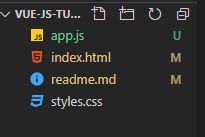

---

# **The Vue Instance**

---

- `new Vue({});` controls the whole part or a certain part of the application.

`index.html`

```html
<!DOCTYPE html>
<html lang="en">
  <head>
    <meta charset="UTF-8" />
    <meta name="viewport" content="width=device-width, initial-scale=1.0" />
    <title>Vue JS - Tutorials</title>
    <link href="styles.css" rel="stylesheet" />
    <script src="https://unpkg.com/vue"></script>
  </head>
  <body>
    <div id="vue-app">
      <h1>{{ name }}</h1>
    </div>
    <script src="app.js"></script>
  </body>
</html>
```

- We name the `div` with `id=vue-app`

- here we shows the `name` variable with in the `div` with the `id` inside `{{ }}`.

`app.js`

```js
new Vue({
  el: "#vue-app", //connects with a `div` inside index.html
  data: {
    name: "Imrul Hasan",
  },
});
```

- Here `el` parameter takes the id of `div` inside `index.html` to control the div.

- pass the data with `name` variable using `data` parameter from `app.js` to the `div` with the `id`.

---

# **Data and Methods**

---

- Git: **git checkout data_methods**

## Get the method value

`index.html`

```html
<body>
  <div id="vue-app">
    <h1>{{ greet() }}</h1>
    <p>Name: {{ name }}</p>
    <p>Job: {{ job }}</p>
  </div>
  <script src="app.js"></script>
</body>
```

- we call the function usign `greet()`

`app.js`

```js
new Vue({
  el: "#vue-app", //connects with a `div` inside index.html
  data: {
    name: "Imrul Hasan",
    job: "Engineer",
  },
  methods: {
    greet: function () {
      return "Good Morning";
    },
  },
});
```

- `greet` is the name of function

---

## Passing data into function as parameter

`index.html`

```html
<body>
  <div id="vue-app">
    <h1>{{ greet('afternoon') }}</h1>
    <p>Name: {{ name }}</p>
    <p>Job: {{ job }}</p>
  </div>
  <script src="app.js"></script>
</body>
```

`app.js`

```js
new Vue({
  el: "#vue-app", //connects with a `div` inside index.html
  data: {
    name: "Imrul Hasan",
    job: "Engineer",
  },
  methods: {
    greet: function (time) {
      return "Good " + time;
    },
  },
});
```

### Output


---

## Access data inside the Vue instance

- we can also access the data inside view instance from methods.

`app.js`

```js
new Vue({
  el: "#vue-app", //connects with a `div` inside index.html
  data: {
    name: "Imrul Hasan",
    job: "Engineer",
  },
  methods: {
    greet: function (time) {
      to = this.name;
      return "Good " + time + " " + to;
    },
  },
});
```

---

---

# **Data Binding**

---

- How can pass a variable to `href` inside `index.html`?

`index.html`

```html
<body>
  <div id="vue-app">
    <h1>Data Binding</h1>
    <a v-bind:href="website">Portfolio</a>
  </div>
  <script src="app.js"></script>
</body>
```

> Use `v-bind:href` instead of just `href` to bind with Vue data.

`app.js`

```js
new Vue({
  el: "#vue-app", //connects with a `div` inside index.html
  data: {
    name: "Imrul Hasan",
    job: "Engineer",
    website: "https://imrulhasan.me",
  },
  methods: {
    greet: function (time) {
      to = this.name;
      return "Good " + time + " " + to;
    },
  },
});
```

### Inspect

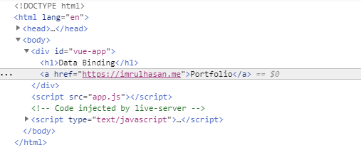

Another example

`index.html`

```html
<input type="text" v-bind:value="name" />
```

- So `v-bind:` is used to bind data with different attributes.

---

## How to get full `tags` from **js** inside **index.html**?

`index.html`

```html
<body>
  <div id="vue-app">
    <h1>Data Binding</h1>
    <a v-bind:href="website">Portfolio</a>
    <br />
    <input type="text" v-bind:value="name" />
    <br />
    <p v-html="websiteTag"></p>
  </div>
  <script src="app.js"></script>
</body>
```

- Here we bind with `v-html`.

`app.js`

```js
new Vue({
  el: "#vue-app", //connects with a `div` inside index.html
  data: {
    name: "Imrul Hasan",
    job: "Engineer",
    website: "https://imrulhasan.me",
    websiteTag: '<a href="https://imrulhasan.me">Portfolio</a>',
  },
  methods: {
    greet: function (time) {
      to = this.name;
      return "Good " + time + " " + to;
    },
  },
});
```

## Outputs


---

# **Events**

---

## Increament / Substract age with click event

`app.js`

```js
new Vue({
  el: "#vue-app", //connects with a `div` inside index.html
  data: {
    age: 25,
  },
  methods: {
    //
  },
});
```

`index.html`

```html
<body>
  <div id="vue-app">
    <h1>Events</h1>
    <button v-on:click="age++">Add a year</button>
    <button v-on:click="age--">Substract a Yeat</button>
    <p>My age is {{ age }}</p>
  </div>
  <script src="app.js"></script>
</body>
```

- here for click event we use `v-on:click` **directive** and inside `""` we pass the data with some operation.

---

## Increament / Substract age with click event using function

`app.js`

```js
new Vue({
  el: "#vue-app", //connects with a `div` inside index.html
  data: {
    age: 25,
  },
  methods: {
    add: function () {
      this.age++;
    },
    sub: function () {
      this.age--;
    },
  },
});
```

`index.html`

```html
<body>
  <div id="vue-app">
    <h1>Events</h1>
    <button v-on:click="add">Add a year</button>
    <button v-on:click="sub">Substract a Yeat</button>
    <p>My age is {{ age }}</p>
  </div>
  <script src="app.js"></script>
</body>
```

- here `add` and `sub` are functions name.
- notice we don't need to add `()` after function name.

---

## **Double Click** event

`app.js`

```js
new Vue({
  el: "#vue-app", //connects with a `div` inside index.html
  data: {
    age: 25,
  },
  methods: {
    add: function (inc) {
      this.age += inc;
    },
    sub: function (dec) {
      this.age -= dec;
    },
  },
});
```

`index.html`

```html
<body>
  <div id="vue-app">
    <h1>Events</h1>
    <button v-on:click="add(1)">Add a year</button>
    <button v-on:click="sub(1)">Substract a Yeat</button>
    <button v-on:dblclick="add(10)">Add 10 year</button>
    <button v-on:dblclick="sub(10)">Substract 10 Yeat</button>
    <p>My age is {{ age }}</p>
  </div>
  <script src="app.js"></script>
</body>
```

- Here we pass value to paratameter using `functionName(param)`

---

## **Mouse Event** to view x,y axises on Screen

`app.js`

```js
new Vue({
  el: "#vue-app", //connects with a `div` inside index.html
  data: {
    x: 0,
    y: 0,
  },
  methods: {
    updateXY: function (event) {
      // console.log(event);
      this.x = event.offsetX;
      this.y = event.offsetY;
    },
  },
});
```

`styles.css`

```css
#canvas {
  width: 600px;
  padding: 200px 20px;
  text-align: center;
  border: 1px solid #333;
}
```

`index.html`

```html
<body>
  <div id="vue-app">
    <h1>Events</h1>
    <div id="canvas" v-on:mousemove="updateXY">{{ x }} , {{ y }}</div>
  </div>
  <script src="app.js"></script>
</body>
```

### Output

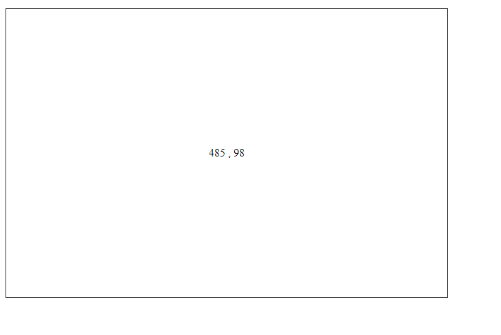

---

## Shothand

- We don't need to use `v-on` all the time.
- we can use `@` instead of `v-on:` to bind
- example below

```html
<div id="canvas" @mousemove="updateXY">{{ x }} , {{ y }}</div>
```

---

---

# **Event Modifier**

---

## Once Modifier

`index.html`

`app.js`

```js
new Vue({
  el: "#vue-app",
  data: {
    age: 25,
  },
  methods: {
    add: function (inc) {
      this.age += inc;
    },
  },
});
```

```html
<body>
  <div id="vue-app">
    <h1>Event Modifiers</h1>
    <button v-on:click.once="add(1)">Event Modifier: Once</button>
    <p>My age is {{ age }}</p>
  </div>
  <script src="app.js"></script>
</body>
```

- So age will increments once

---

## Prevent Modifier

`app.js`

```js
new Vue({
  el: "#vue-app",
  data: {
    age: 25,
  },
  methods: {
    add: function (inc) {
      this.age += inc;
    },
    click: function () {
      alert("You Click Me");
    },
  },
});
```

`index.html`

```html
<body>
  <div id="vue-app">
    <h1>Event Modifiers</h1>
    <button v-on:click.once="add(1)">Event Modifier: Once</button>
    <p>My age is {{ age }}</p>
    <a v-on:click.prevent="click" href="https://www.imrulhasan.me">Portfolio</a>
  </div>
  <script src="app.js"></script>
</body>
```

- Now although we click on link. But It prevents to go to the `href` using `v-on:click.prevent`

---

---

# **Keyboard Events**

---

`app.js`

```js
new Vue({
  el: "#vue-app",
  data: {
    name: "",
    age: "",
  },
  methods: {
    logName: function () {
      console.log("you entered your name");
    },
    logAge: function () {
      console.log("you entered your age");
    },
  },
});
```

`index.html`

```html
<body>
  <div id="vue-app">
    <h1>Keyboard Events</h1>
    <label>Name:</label>
    <input type="text" v-on:keyup.enter="logName" v-model="name" />
    <span>{{ name }}</span>
    <br />
    <br />
    <label>Age:</label>
    <input type="text" v-on:keyup.alt.enter="logAge" v-model="age" />
    <span>{{ age }}</span>
  </div>
  <script src="app.js"></script>
</body>
```

---

---

# **Computed Properties**

---

- Git: **git checkout computed_property**

---

## Using Normal Methods

`app.js`

```js
new Vue({
  el: "#vue-app",
  data: {
    a: 0,
    b: 0,
    age: 20,
  },
  methods: {
    addToA: function () {
      console.log("addToA");
      return this.a + this.age;
    },
    addToB: function () {
      console.log("addToB");
      return this.b + this.age;
    },
  },
});
```

`index.html`

```html
<body>
  <div id="vue-app">
    <h1>Computed Properties</h1>
    <button v-on:click="a++">Add to A</button>
    <button v-on:click="b++">Add to B</button>
    <p>A - {{ a }}</p>
    <p>B - {{ b }}</p>
    <p>Age + A = {{ addToA() }}</p>
    <p>Age + B = {{ addToB() }}</p>
  </div>
</body>
```

### Output

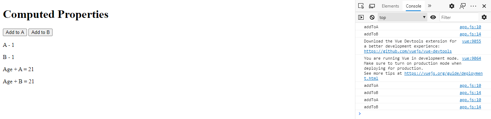

### Problem:

- Every time we change A or B, both `addToA()` and `addToB()` function calls. Which is enefficient.

### Solution? -> computed

---

## Using Computed

`app.js`

```js
new Vue({
  el: "#vue-app",
  data: {
    a: 0,
    b: 0,
    age: 20,
  },

  computed: {
    addToA: function () {
      console.log("addToA");
      return this.a + this.age;
    },
    addToB: function () {
      console.log("addToB");
      return this.b + this.age;
    },
  },
});
```

`index.html`

```html
<body>
  <div id="vue-app">
    <h1>Computed Properties</h1>
    <button v-on:click="a++">Add to A</button>
    <button v-on:click="b++">Add to B</button>
    <p>A - {{ a }}</p>
    <p>B - {{ b }}</p>
    <p>Age + A = {{ addToA }}</p>
    <p>Age + B = {{ addToB }}</p>
  </div>
</body>
```

### Output


---

---

---

# **Dynamic CSS**

---

- Git: **git checkout dyamic_css**

## Example 1

`styles.css`

```css
span {
  background: red;
  display: inline-block;
  padding: 10px;
  color: #fff;
  margin: 10px 0;
}

.available span {
  background: green;
}
```

`app.js`

```js
new Vue({
  el: "#vue-app",
  data: {
    available: false,
  },
  methods: {},
  computed: {},
});
```

`index.html`

```html
<body>
  <div id="vue-app">
    <h1>Dynamic CSS</h1>
    <h2>Example 1</h2>
    <div
      v-on:click="available = !available"
      v-bind:class="{available: available}"
    >
      <span>Ryu</span>
    </div>
  </div>
</body>
```

- here `v-bind:class="{className: variableName}"`,

### Output

Case 1:

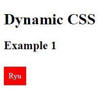

Case 2: When CLick on **Ryu**

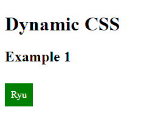

---

## Example 2 [Recommanded Way]

`styles.css`

```css
span {
  background: red;
  display: inline-block;
  padding: 10px;
  color: #fff;
  margin: 10px 0;
}

.available span {
  background: green;
}

.nearby span:after {
  content: "nearby";
  margin-left: 10px;
}
```

`app.js`

```js
new Vue({
  el: "#vue-app",
  data: {
    available: false,
    nearby: false,
  },
  methods: {},
  computed: {
    compClasses: function () {
      return {
        available: this.available, //will return if true
        nearby: this.nearby, //will return if true
      };
    },
  },
});
```

`index.html`

```html
<body>
  <div id="vue-app">
    <h1>Dynamic CSS</h1>
    <h2>Example 2</h2>
    <button v-on:click="nearby = !nearby">Toggle nearby</button>
    <button v-on:click="available = !available">Toggle available</button>
    <div v-bind:class="compClasses">
      <span>Ryu</span>
    </div>
  </div>
</body>
```

- Here on `compClasses` there will be the objects if they are true. These object defined in `compClasses` computed in `app.js`

### Output

Case 1:

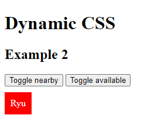

Case 2: Click on both button

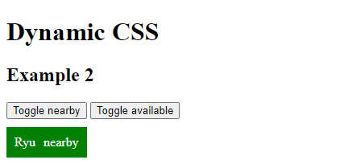

---

---

---

# **Conditionals**

---

- Git: **git checkout conditionals**

`app.js`

```js
new Vue({
  el: "#vue-app",
  data: {
    error: false,
    success: false,
  },
  methods: {},
  computed: {},
});
```

`index.html`

```html
<body>
  <div id="vue-app">
    <h1>Conditionals</h1>
    <button v-on:click="error = !error">Toggle Error</button>
    <button v-on:click="success = !success">Toggle Success</button>
    <p v-if="error" class="error">There has been an error</p>
    <p v-else-if="success" class="success">Whooo, success :)</p>
  </div>
</body>
```

---

`index.html`

```html
<body>
  <div id="vue-app">
    <h1>Conditionals</h1>
    <button v-on:click="error = !error">Toggle Error</button>
    <button v-on:click="success = !success">Toggle Success</button>
    <p v-show="error" class="error">There has been an error</p>
    <p v-show="success" class="success">Whooo, success :)</p>
  </div>
</body>
```

- `v-show` is based on `display: none`. So the content will not deleted from `elements inspect`.

---

---

# **Looping with v-for**

---

- Git: **git checkout for_loop**

`app.js`

```js
new Vue({
  el: "#vue-app",
  data: {
    characters: ["Mario", "Luigi", "Yoshi", "Bowser"],
    ninjas: [
      { name: "Ryu", age: 25 },
      { name: "Yoshi", age: 35 },
      { name: "Ken", age: 55 },
    ],
  },
  methods: {},
  computed: {},
});
```

### Way 1:

`index.html`

```html
<body>
  <div id="vue-app">
    <h1>Looping through lists</h1>
    <ul>
      <li v-for="character in characters">{{ character }}</li>
    </ul>
  </div>
</body>
```

## Output

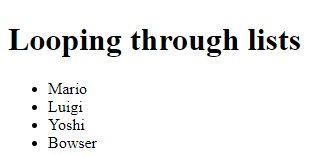

### Way 2:

`index.html`

```html
<body>
  <div id="vue-app">
    <h1>Looping through lists</h1>
    <ul>
      <li v-for="(ninja, index) in ninjas">
        {{ index }} . {{ ninja.name }} - {{ ninja.age }}
      </li>
    </ul>
  </div>
</body>
```

## Output

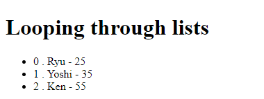

### Way 3:

`index.html`

```html
<body>
  <div id="vue-app">
    <h1>Looping through lists</h1>
    <div v-for="(ninja, index) in ninjas">
      <h3>{{ index }} . {{ ninja.name }}</h3>
      <p>Age - {{ ninja.age }}</p>
    </div>
  </div>
</body>
```

## Output

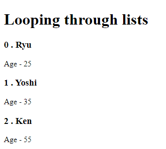

### Way 4:

`index.html`

```html
<body>
  <div id="vue-app">
    <h1>Looping through lists</h1>
    <template v-for="ninja in ninjas">
      <div v-for="(val, key) in ninja">
        <p>{{key}} - {{ val }}</p>
      </div>
      <hr />
    </template>
  </div>
</body>
```

## Output

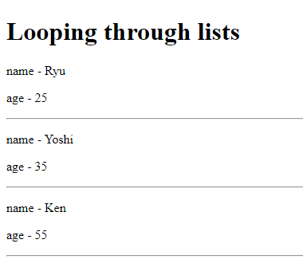

---

# **Simple Punchbag Game**

---

`styles.css`

```css
#bag {
  width: 200px;
  height: 500px;
  margin: 0 auto;
  background: url(/img/bag.png) center no-repeat;
  background-size: 80%;
}

#bag.burst {
  background-image: url(/img/bag-burst.png);
}

#bag-health {
  width: 200px;
  border: 2px solid #000;
  margin: 0 auto 20px auto;
}

#bag-health div {
  height: 20px;
  background: crimson;
}

#controls {
  width: 120px;
  margin: 0 auto;
}
```

`app.js`

```js
new Vue({
  el: "#vue-app",
  data: {
    health: 100,
    ended: false,
  },
  methods: {
    punch: function () {
      this.health -= 10;
      if (this.health <= 0) {
        this.ended = true;
      }
    },
    restart: function () {
      this.health = 100;
      this.ended = false;
    },
  },
  computed: {},
});
```

`index.html`

```html
<body>
  <div id="vue-app">
    <!-- bag image -->
    <div id="bag" v-bind:class="{ burst: ended }"></div>

    <!-- bag health bar -->
    <div id="bag-health">
      <div v-bind:style="{ width: health + '%' }"></div>
    </div>

    <!-- game control buttons -->
    <div id="controls">
      <button v-on:click="punch" v-show="!ended">Punch</button>
      <button v-on:click="restart">Restart</button>
    </div>
  </div>
</body>
```

## Output

Puncing

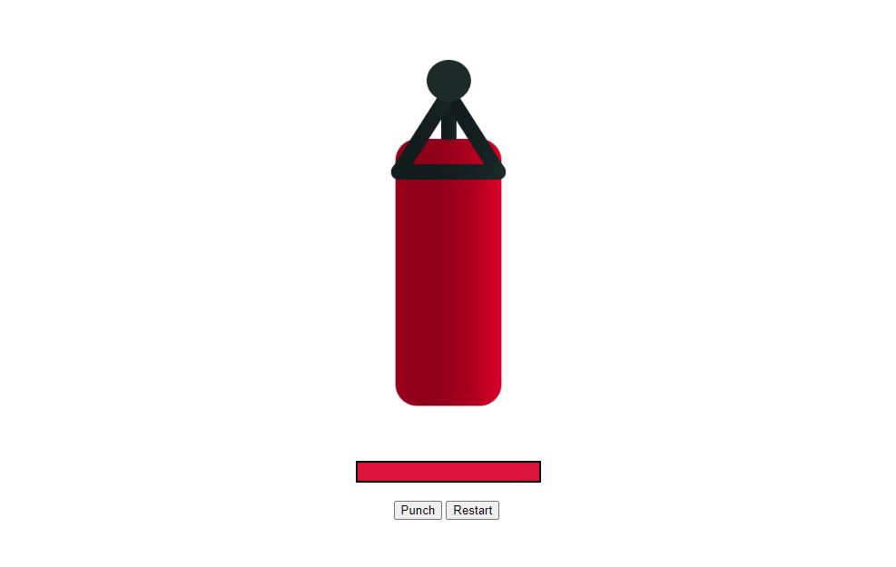

Puncing

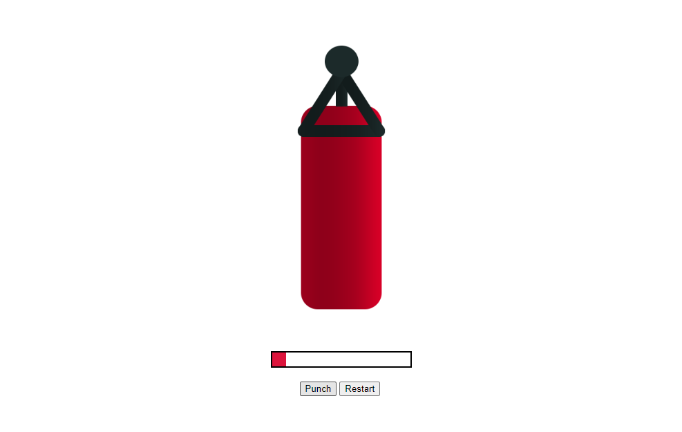

Puncing

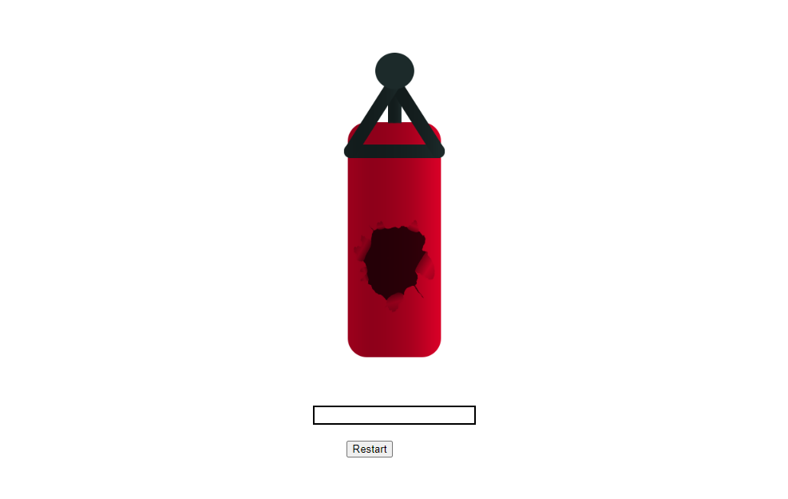

---

# **Multiple Vue Instances**

---

`app.js`

```js
var one = new Vue({
  el: "#vue-app-one",
  data: {
    title: "Vue App One",
  },
  computed: {
    greet: function () {
      return "Hello, from app one :)";
    },
  },
});

var two = new Vue({
  el: "#vue-app-two",
  data: {
    title: "Vue App Two",
  },
  computed: {
    greet: function () {
      return "Yo dudes, this is app 2 speaking to ya";
    },
  },
  methods: {
    changeTitle: function () {
      one.title = "Title Changed";
    },
  },
});

two.title = "Changed from outside";
```

`index.html`

```html
<body>
  <h1>Multiple Vue instances</h1>
  <div id="vue-app-one">
    <h2>{{ title }}</h2>
    <p>{{ greet }}</p>
  </div>
  <hr />
  <div id="vue-app-two">
    <h2>{{ title }}</h2>
    <p>{{ greet }}</p>
    <button v-on:click="changeTitle">Change App One Title</button>
  </div>
</body>
```

### Output

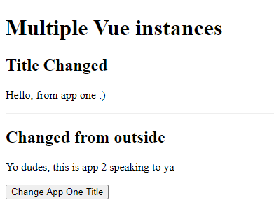

---

---

# **Components**

---

`app.js`

```js
Vue.component("greeting", {
  template:
    "<p>re-usable component. {{name}}. <button v-on:click='changeName'>Change Name</button> </p>",

  data: function () {
    return {
      name: "Imrul",
    };
  },

  methods: {
    changeName: function () {
      this.name = "Hasan";
    },
  },
});

new Vue({
  el: "#vue-app-one",
});

new Vue({
  el: "#vue-app-two",
});
```

`index.html`

```html
<body>
  <h1>Templates</h1>
  <div id="vue-app-one">
    <h1>Vue App One</h1>
    <greeting></greeting>
  </div>
  <div id="vue-app-two">
    <h1>Vue App Two</h1>
    <greeting></greeting>
  </div>
</body>
```

---

---

# **Refs**

---

`app.js`

```js
new Vue({
  el: "#vue-app-one",
  data: {
    output: "Your favourite food",
  },
  methods: {
    readRefs: function () {
      console.log(this.$refs);
      this.output = this.$refs.input2.value;
    },
  },
});
```

`index.html`

```html
<body>
  <h1>Refs</h1>
  <div id="vue-app-one">
    <input type="text" ref="input" />
    <button v-on:click="readRefs">Submit</button>
    <p>{{ output }}</p>
  </div>
</body>
```

---

# **Vue CLI**

---
