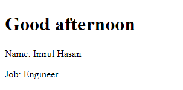

# Vue JS tutorials

---

# Installation

---

CDN [For Testing Purpose Only]

```php
<script src="https://unpkg.com/vue@next"></script>
```

## Folder Structure


---

# **The Vue Instance**

---

- `new Vue({});` controls the whole part or a certain part of the application.

`index.html`

```html
<!DOCTYPE html>
<html lang="en">
  <head>
    <meta charset="UTF-8" />
    <meta name="viewport" content="width=device-width, initial-scale=1.0" />
    <title>Vue JS - Tutorials</title>
    <link href="styles.css" rel="stylesheet" />
    <script src="https://unpkg.com/vue"></script>
  </head>
  <body>
    <div id="vue-app">
      <h1>{{ name }}</h1>
    </div>
    <script src="app.js"></script>
  </body>
</html>
```

- We name the `div` with `id=vue-app`

- here we shows the `name` variable with in the `div` with the `id` inside `{{ }}`.

`app.js`

```js
new Vue({
  el: "#vue-app", //connects with a `div` inside index.html
  data: {
    name: "Imrul Hasan",
  },
});
```

- Here `el` parameter takes the id of `div` inside `index.html` to control the div.

- pass the data with `name` variable using `data` parameter from `app.js` to the `div` with the `id`.

---

# **Data and Methods**

---

- Git: **git checkout data_methods**

## Get the method value

`index.html`

```html
<body>
  <div id="vue-app">
    <h1>{{ greet() }}</h1>
    <p>Name: {{ name }}</p>
    <p>Job: {{ job }}</p>
  </div>
  <script src="app.js"></script>
</body>
```

- we call the function usign `greet()`

`app.js`

```js
new Vue({
  el: "#vue-app", //connects with a `div` inside index.html
  data: {
    name: "Imrul Hasan",
    job: "Engineer",
  },
  methods: {
    greet: function () {
      return "Good Morning";
    },
  },
});
```

- `greet` is the name of function

---

## Passing data into function as parameter

`index.html`

```html
<body>
  <div id="vue-app">
    <h1>{{ greet('afternoon') }}</h1>
    <p>Name: {{ name }}</p>
    <p>Job: {{ job }}</p>
  </div>
  <script src="app.js"></script>
</body>
```

`app.js`

```js
new Vue({
  el: "#vue-app", //connects with a `div` inside index.html
  data: {
    name: "Imrul Hasan",
    job: "Engineer",
  },
  methods: {
    greet: function (time) {
      return "Good " + time;
    },
  },
});
```

### Output



---

## Access data inside the Vue instance

- we can also access the data inside view instance from methods.

`app.js`

```js
new Vue({
  el: "#vue-app", //connects with a `div` inside index.html
  data: {
    name: "Imrul Hasan",
    job: "Engineer",
  },
  methods: {
    greet: function (time) {
      to = this.name;
      return "Good " + time + " " + to;
    },
  },
});
```

---

---

# **Data Binding**

---

- How can pass a variable to `href` inside `index.html`?

`index.html`

```html
<body>
  <div id="vue-app">
    <h1>Data Binding</h1>
    <a v-bind:href="website">Portfolio</a>
  </div>
  <script src="app.js"></script>
</body>
```

> Use `v-bind:href` instead of just `href` to bind with Vue data.

`app.js`

```js
new Vue({
  el: "#vue-app", //connects with a `div` inside index.html
  data: {
    name: "Imrul Hasan",
    job: "Engineer",
    website: "https://imrulhasan.me",
  },
  methods: {
    greet: function (time) {
      to = this.name;
      return "Good " + time + " " + to;
    },
  },
});
```

### Inspect


Another example

`index.html`

```html
<input type="text" v-bind:value="name" />
```

- So `v-bind:` is used to bind data with different attributes.

---

## How to get full `tags` from **js** inside **index.html**?

`index.html`

```html
<body>
  <div id="vue-app">
    <h1>Data Binding</h1>
    <a v-bind:href="website">Portfolio</a>
    <br />
    <input type="text" v-bind:value="name" />
    <br />
    <p v-html="websiteTag"></p>
  </div>
  <script src="app.js"></script>
</body>
```

- Here we bind with `v-html`.

`app.js`

```js
new Vue({
  el: "#vue-app", //connects with a `div` inside index.html
  data: {
    name: "Imrul Hasan",
    job: "Engineer",
    website: "https://imrulhasan.me",
    websiteTag: '<a href="https://imrulhasan.me">Portfolio</a>',
  },
  methods: {
    greet: function (time) {
      to = this.name;
      return "Good " + time + " " + to;
    },
  },
});
```

## Outputs


---

# **Events**

---

## Increament / Substract age with click event

`app.js`

```js
new Vue({
  el: "#vue-app", //connects with a `div` inside index.html
  data: {
    age: 25,
  },
  methods: {
    //
  },
});
```

`index.html`

```html
<body>
  <div id="vue-app">
    <h1>Events</h1>
    <button v-on:click="age++">Add a year</button>
    <button v-on:click="age--">Substract a Yeat</button>
    <p>My age is {{ age }}</p>
  </div>
  <script src="app.js"></script>
</body>
```

- here for click event we use `v-on:click` **directive** and inside `""` we pass the data with some operation.

---

## Increament / Substract age with click event using function

`app.js`

```js
new Vue({
  el: "#vue-app", //connects with a `div` inside index.html
  data: {
    age: 25,
  },
  methods: {
    add: function () {
      this.age++;
    },
    sub: function () {
      this.age--;
    },
  },
});
```

`index.html`

```html
<body>
  <div id="vue-app">
    <h1>Events</h1>
    <button v-on:click="add">Add a year</button>
    <button v-on:click="sub">Substract a Yeat</button>
    <p>My age is {{ age }}</p>
  </div>
  <script src="app.js"></script>
</body>
```

- here `add` and `sub` are functions name.
- notice we don't need to add `()` after function name.

---

## **Double Click** event

`app.js`

```js
new Vue({
  el: "#vue-app", //connects with a `div` inside index.html
  data: {
    age: 25,
  },
  methods: {
    add: function (inc) {
      this.age += inc;
    },
    sub: function (dec) {
      this.age -= dec;
    },
  },
});
```

`index.html`

```html
<body>
  <div id="vue-app">
    <h1>Events</h1>
    <button v-on:click="add(1)">Add a year</button>
    <button v-on:click="sub(1)">Substract a Yeat</button>
    <button v-on:dblclick="add(10)">Add 10 year</button>
    <button v-on:dblclick="sub(10)">Substract 10 Yeat</button>
    <p>My age is {{ age }}</p>
  </div>
  <script src="app.js"></script>
</body>
```

- Here we pass value to paratameter using `functionName(param)`

---

## **Mouse Event** to view x,y axises on Screen

`app.js`

```js
new Vue({
  el: "#vue-app", //connects with a `div` inside index.html
  data: {
    x: 0,
    y: 0,
  },
  methods: {
    updateXY: function (event) {
      // console.log(event);
      this.x = event.offsetX;
      this.y = event.offsetY;
    },
  },
});
```

`styles.css`

```css
#canvas {
  width: 600px;
  padding: 200px 20px;
  text-align: center;
  border: 1px solid #333;
}
```

`index.html`

```html
<body>
  <div id="vue-app">
    <h1>Events</h1>
    <div id="canvas" v-on:mousemove="updateXY">{{ x }} , {{ y }}</div>
  </div>
  <script src="app.js"></script>
</body>
```

### Output


---

## Shothand

- We don't need to use `v-on` all the time.
- we can use `@` instead of `v-on:` to bind
- example below

```html
<div id="canvas" @mousemove="updateXY">{{ x }} , {{ y }}</div>
```

---
